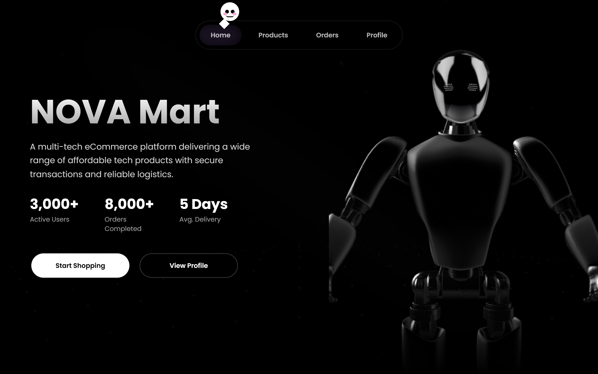
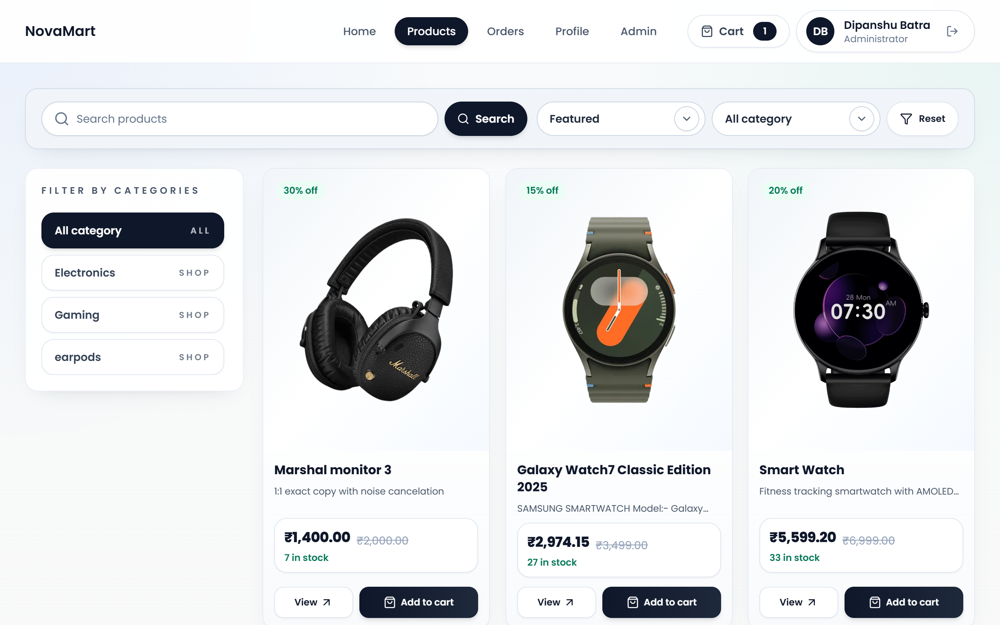
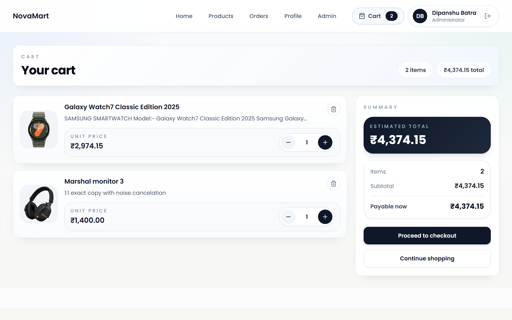
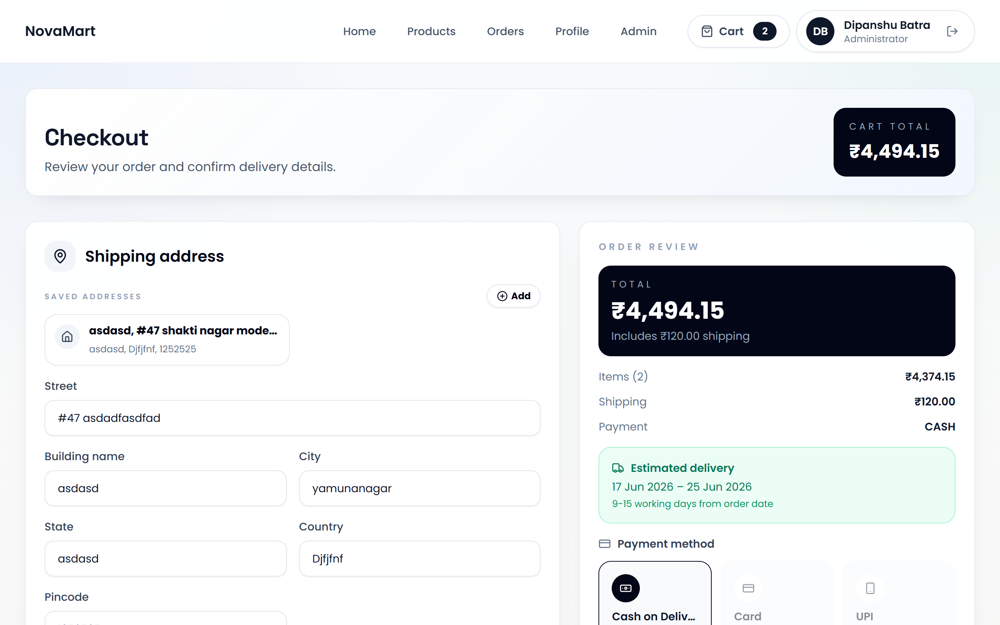
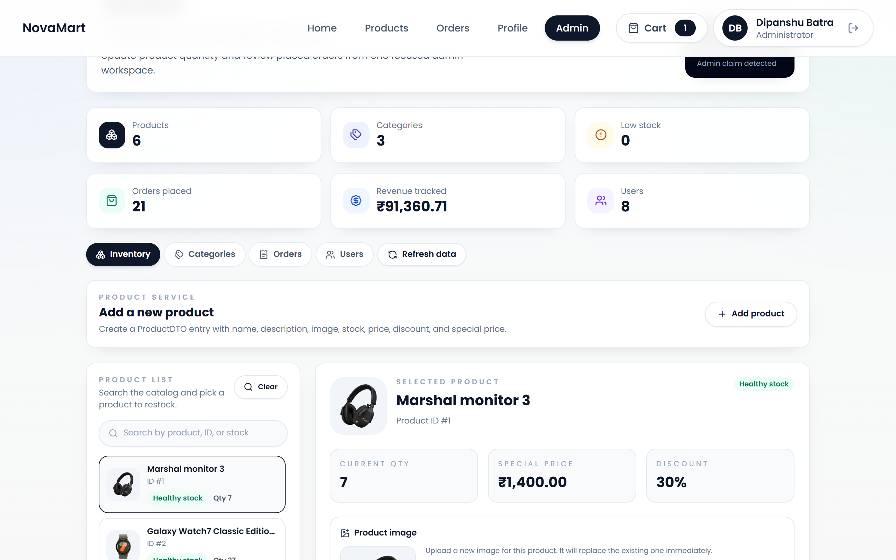
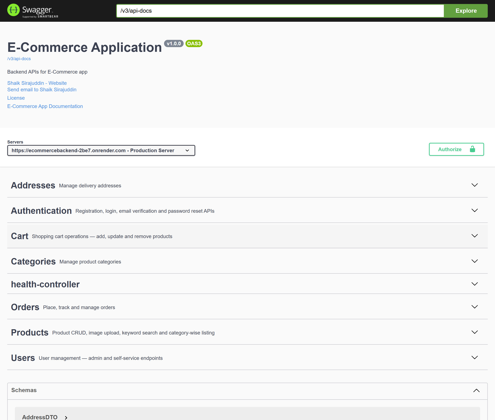
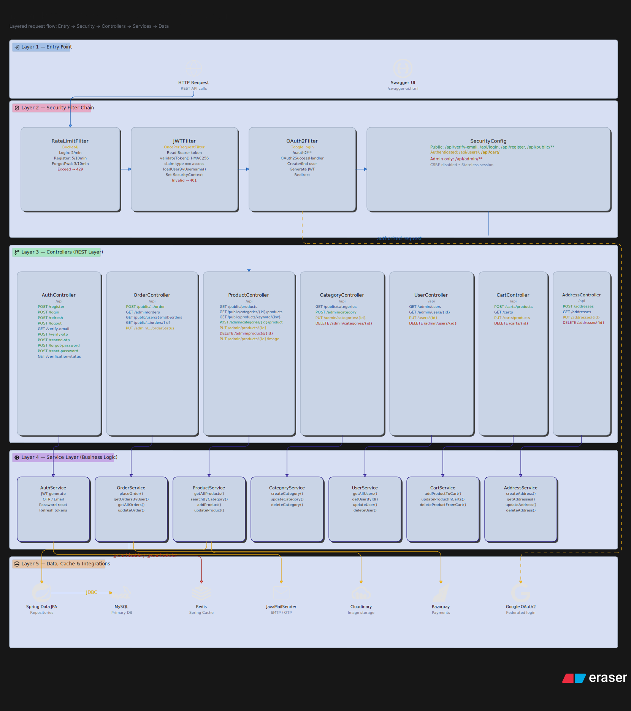
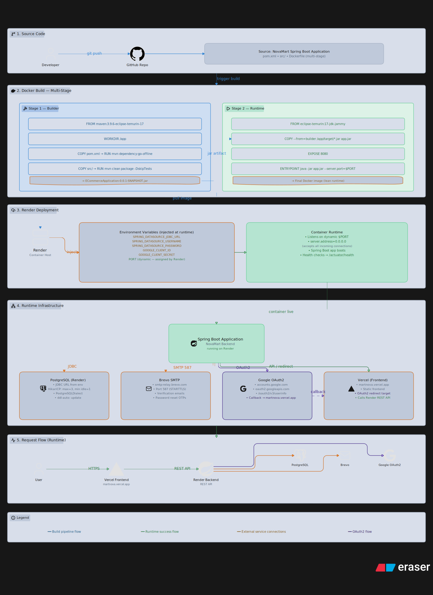
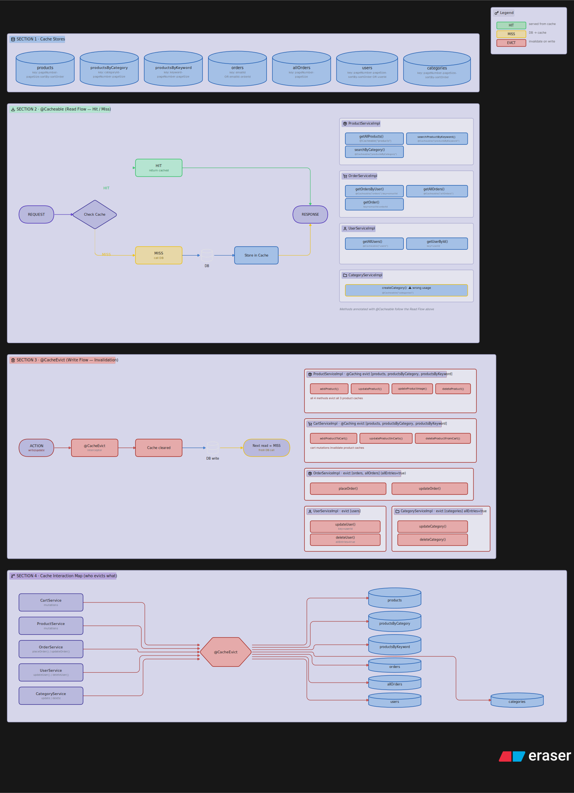

<p align="center">
  
</p>

<p align="center">
  
  
  
  
  
  
  
</p>

<h1 align="center">🛒 NovaMart</h1>

<p align="center">
  A production-ready e-commerce platform with secure authentication, real-time inventory management, and automated order processing — built with <strong>Spring Boot 3</strong> and <strong>React</strong>.
</p>

<p align="center">
  <a href="https://martnova.vercel.app"></a>
  &nbsp;
  <a href="https://ecommercebackend-2be7.onrender.com/swagger-ui/index.html"></a>
</p>

---

## 📌 Table of Contents

- [Overview](#-overview)
- [Screenshots](#-screenshots)
- [Tech Stack](#-tech-stack)
- [Architecture](#-architecture)
- [Features](#-features)
- [API Endpoints](#-api-endpoints)
- [Authentication Flow](#-authentication-flow)
- [Caching Strategy](#-caching-strategy)
- [Rate Limiting](#-rate-limiting)
- [Email System](#-email-system)
- [Database Schema](#-database-schema)
- [Performance Testing](#-performance-testing)
- [Local Setup](#-local-setup)
- [Deployment](#-deployment)
- [Project Structure](#-project-structure)
- [License](#-license)

---

## 🧭 Overview

NovaMart is a fully containerized, production-ready e-commerce platform. It features comprehensive user authentication with **JWT and Google OAuth2**, real-time cart management with stock reservation, automated email notifications via **Brevo API**, and intelligent caching for optimal performance.

The system is deployed using **Docker** on Render (backend) and **Vercel** (frontend) with a managed PostgreSQL database.

> ⚠️ The source code for this project is **private**. This repository serves as a public showcase with diagrams, screenshots, API documentation, and performance results.

---

## 📸 Screenshots

| Home Page | Product Page | Cart Page |
|:---------:|:------------:|:---------:|
|  |  |  |

| Checkout Page | Admin Dashboard | Swagger API |
|:-------------:|:---------------:|:-----------:|
|  |  |  |

---

## 🛠 Tech Stack

| Category | Technology | Purpose |
|----------|------------|---------|
| Backend Language | Java 17 | Core application logic |
| Backend Framework | Spring Boot 3.0.1 | Application framework |
| Security | Spring Security + JWT (auth0 java-jwt 4.2.1) | Authentication & authorization |
| OAuth2 | Spring OAuth2 Client | Google OAuth2 login |
| Database | Spring Data JPA + PostgreSQL | Data persistence |
| Caching | Spring Boot Cache (`@Cacheable`, `@CacheEvict`) | Performance optimization |
| Email | Spring Boot Mail + Brevo SMTP API | Transactional emails via REST |
| Validation | Spring Boot Validation | Input validation |
| API Documentation | SpringDoc OpenAPI / Swagger UI 2.0.2 | API documentation |
| Rate Limiting | Bucket4j 8.1.1 | IP-based rate limiting |
| Object Mapping | ModelMapper 3.1.1 | DTO mapping |
| Code Generation | Lombok 1.18.30 | Reduce boilerplate |
| Scheduling | Spring Boot Scheduling (`@Scheduled`) | Scheduled tasks |
| Async Processing | Spring Boot Async (`@Async`) | Asynchronous operations |
| Containerization | Docker | Container deployment |
| Frontend | React | User interface |
| Frontend Deployment | Vercel | Frontend hosting |
| Backend Deployment | Render | Backend hosting |
| Database Hosting | PostgreSQL on Render | Managed database |

---

## 🏗 Architecture

<p align="center">
  
</p>

The system follows a microservices-inspired architecture with clear separation of concerns. The Spring Boot backend handles all business logic, authentication, and data persistence, while the React frontend provides a responsive user interface. PostgreSQL serves as the primary database with Spring Cache for performance optimization. The system is deployed using Docker containers on Render for the backend and Vercel for the frontend.

<p align="center">
  
</p>

---

## ✨ Features

### 🔐 Authentication Module
- User registration with email verification (OTP + verification link)
- Email verification via clickable link token
- Email verification via 6-digit OTP (max 5 attempts, then locked)
- JWT-based login with access and refresh tokens
- Refresh token rotation (old token invalidated, new pair issued)
- Secure logout with refresh token invalidation
- OTP resend with 3-minute cooldown enforcement
- Forgot password with OTP reset
- Password reset with max 5 attempts (invalidates all refresh tokens)
- Email verification status check
- Google OAuth2 login with auto user/cart creation and JWT token issuance

### 🛡️ JWT Security
- Access Token: 15 minutes expiry (HMAC256)
- Refresh Token: 7 days expiry, stored in database
- Token rotation on every refresh
- JWT Filter validates token type (access vs refresh)
- Token type claim (`"access"` / `"refresh"`) prevents token misuse

### 🚦 Rate Limiting
- Login: 5 attempts per minute per IP
- Register: 5 attempts per 10 minutes per IP
- Forgot Password: 3 attempts per 10 minutes per IP
- In-memory `ConcurrentHashMap` per IP using Bucket4j

### 👤 User Module
- Paginated user list (Admin only)
- Get own profile from JWT
- Update own profile
- Delete user with cart cleanup (Admin only)
- Auto-creates cart on registration
- Role-based access: `ADMIN` (roleId=101), `USER` (roleId=102)
- Roles seeded via `CommandLineRunner` on startup

### 📦 Product Module
- Add product to category (Admin)
- Paginated product list (cached)
- Admin product list
- Products by category (cached)
- Case-insensitive keyword search (cached)
- Update product with special price recalculation and cart synchronization
- Upload product image (multipart)
- Soft-safe delete with order item nullification and cart clearing
- Special price auto-calculation: `price - (discount% * price)`, rounded to 2 decimal places

### 📂 Category Module
- Create, update, delete category (Admin)
- Paginated category list (public)

### 🛒 Cart Module
- Add product to cart with stock reservation check (`quantity - reservedQuantity`)
- Duplicate product prevention in cart
- All carts list (Admin)
- Get user's cart
- Update quantity with reserved quantity adjustment
- Remove from cart with reserved quantity release
- Auto-recalculate cart total on every operation
- Abandoned cart cleanup scheduler

### 📋 Order Module
- Place order with stock pre-check
- Payment entity creation
- Shipping address snapshot on order
- Product quantity decrement + cart clearing after order
- Order confirmation email (async via Brevo)
- Paginated all orders (Admin, cached)
- User's orders (cached by email)
- Single order details (cached)
- Update order status (Admin, cache evicted)
- Order statuses: `Order Accepted !` → `SHIPPED` → `DELIVERED`

### 📍 Address Module
- Create, read, update, delete addresses
- Update with deduplication (reassigns users if same address exists)
- Delete removes address from all associated users

### 📧 Email System (Brevo REST API)
All emails sent asynchronously via `@Async`:
- **Verification Email** — 6-digit OTP (10 min expiry) + clickable link, HTML styled
- **Password Reset OTP Email** — 6-digit OTP, 10 min expiry
- **Order Confirmation Email** — full order summary table with items, quantities, prices, total, animated HTML
- **Daily Report Email** — revenue, total orders, new users, cancelled orders for previous day

### ⏰ Scheduler
- Daily report at **9:00 AM** (cron: `0 0 9 * * *`)
- Fetches yesterday's revenue, total orders, new user count, cancelled orders
- Sends daily report email to admin

### 📁 File Service
- Image upload for products (multipart, stored in `images/` folder)
- Serve product images via `GET /api/images/{fileName}`

### 💾 Caching Strategy
- Spring Cache (in-memory / simple cache)
- `@Cacheable` on: `getAllProducts`, `searchByCategory`, `searchByKeyword`, `getAllOrders`, `getUserOrders`, `getOrderById`, `getAllUsers`
- `@CacheEvict` on all mutating operations
- Cache keys use `pageNumber`, `pageSize`, `sortBy`, `sortOrder` combinations

### 🔒 Security Configuration
- **Public routes:** `/api/public/**`, `/api/verify-email`, `/api/register`, `/api/login`, `/api/refresh`, `/api/resend-otp`, `/api/verify-otp`, `/api/forgot-password`, `/api/reset-password`, `/swagger-ui/**`, `/v3/api-docs/**`
- **Admin routes:** `/api/admin/**`
- CORS configured, BCrypt password encoding, OAuth2 login configured

### 🗄️ Database
- PostgreSQL (Render hosted)
- Hibernate DDL `auto=update`
- HikariCP pool: max 3 connections, min idle 1 (Render free tier optimized)
- 13 entities: `User`, `Role`, `Cart`, `CartItem`, `Product`, `Category`, `Order`, `OrderItem`, `Payment`, `Address`, `RefreshToken`, `EmailVerificationToken`, `PasswordResetToken`

---

## 📡 API Endpoints

### Authentication
| Method | Endpoint | Auth | Description |
|--------|----------|:----:|-------------|
| `POST` | `/api/register` | Public | Register user, sends OTP + verification link email |
| `GET` | `/api/verify-email` | Public | Verify via link token |
| `POST` | `/api/verify-otp` | Public | Verify via OTP (max 5 attempts) |
| `POST` | `/api/login` | Public | JWT login (returns accessToken + refreshToken) |
| `POST` | `/api/refresh` | Public | Refresh token rotation |
| `POST` | `/api/logout` | Public | Invalidate refresh token |
| `POST` | `/api/resend-otp` | Public | Resend OTP (3-minute cooldown) |
| `POST` | `/api/forgot-password` | Public | Send password reset OTP |
| `POST` | `/api/reset-password` | Public | Reset password (max 5 attempts) |
| `GET` | `/api/verification-status` | Public | Check if email is verified |

### User
| Method | Endpoint | Auth | Description |
|--------|----------|:----:|-------------|
| `GET` | `/api/admin/users` | Admin | Paginated user list |
| `GET` | `/api/public/users/me` | User | Get own profile from JWT |
| `PUT` | `/api/public/users/me` | User | Update own profile |
| `DELETE` | `/api/admin/users/{userId}` | Admin | Delete user with cart cleanup |

### Product
| Method | Endpoint | Auth | Description |
|--------|----------|:----:|-------------|
| `POST` | `/api/admin/categories/{categoryId}/product` | Admin | Add product |
| `GET` | `/api/public/products` | Public | Paginated product list (cached) |
| `GET` | `/api/admin/products` | Admin | Admin product list |
| `GET` | `/api/public/categories/{categoryId}/products` | Public | Products by category (cached) |
| `GET` | `/api/public/products/keyword/{keyword}` | Public | Case-insensitive search (cached) |
| `PUT` | `/api/admin/products/{productId}` | Admin | Update product |
| `PUT` | `/api/admin/products/{productId}/image` | Admin | Upload product image |
| `DELETE` | `/api/admin/products/{productId}` | Admin | Soft-safe delete |

### Category
| Method | Endpoint | Auth | Description |
|--------|----------|:----:|-------------|
| `POST` | `/api/admin/category` | Admin | Create category |
| `GET` | `/api/public/categories` | Public | Paginated list |
| `PUT` | `/api/admin/categories/{categoryId}` | Admin | Update category |
| `DELETE` | `/api/admin/categories/{categoryId}` | Admin | Delete category |

### Cart
| Method | Endpoint | Auth | Description |
|--------|----------|:----:|-------------|
| `POST` | `/api/public/carts/{cartId}/products/{productId}/quantity/{quantity}` | User | Add to cart |
| `GET` | `/api/admin/carts` | Admin | All carts |
| `GET` | `/api/public/users/{emailId}/carts/{cartId}` | User | Get user's cart |
| `PUT` | `/api/public/carts/{cartId}/products/{productId}/quantity/{quantity}` | User | Update quantity |
| `DELETE` | `/api/public/carts/{cartId}/product/{productId}` | User | Remove from cart |

### Order
| Method | Endpoint | Auth | Description |
|--------|----------|:----:|-------------|
| `POST` | `/api/public/users/{emailId}/carts/{cartId}/payments/{paymentMethod}/order` | User | Place order |
| `GET` | `/api/admin/orders` | Admin | Paginated all orders (cached) |
| `GET` | `/api/public/users/{emailId}/orders` | User | User's orders (cached) |
| `GET` | `/api/public/users/{emailId}/orders/{orderId}` | User | Single order (cached) |
| `PUT` | `/api/admin/users/{emailId}/orders/{orderId}/orderStatus/{orderStatus}` | Admin | Update status |

### Address
| Method | Endpoint | Auth | Description |
|--------|----------|:----:|-------------|
| `POST` | `/api/admin/address` | Admin | Create address |
| `GET` | `/api/admin/addresses` | Admin | All addresses |
| `GET` | `/api/admin/addresses/{addressId}` | Admin | Single address |
| `PUT` | `/api/admin/addresses/{addressId}` | Admin | Update address |
| `DELETE` | `/api/admin/addresses/{addressId}` | Admin | Delete address |

### File Service
| Method | Endpoint | Auth | Description |
|--------|----------|:----:|-------------|
| `GET` | `/api/images/{fileName}` | Public | Serve product images |

---

## 🔑 Authentication Flow

<p align="center">
  
</p>

NovaMart uses a dual authentication system — JWT-based login and Google OAuth2. Users register with email and receive a 6-digit OTP and a clickable verification link. Upon verification, login returns an access token (15 min) and refresh token (7 days). Tokens are rotated on every refresh. Google OAuth2 users are auto-created with a cart on first login and receive JWT tokens immediately.

---

## 💾 Caching Strategy

<p align="center">
  
</p>

The system uses Spring Cache (in-memory) for optimal performance.

| Cache Name | Cache Key |
|------------|-----------|
| `getAllProducts` | `pageNumber + pageSize + sortBy + sortOrder` |
| `searchByCategory` | `categoryId + pagination params` |
| `searchByKeyword` | `keyword + pagination params` |
| `getAllOrders` | `pageNumber + pageSize + sortBy + sortOrder` |
| `getUserOrders` | `email + pagination params` |
| `getOrderById` | `orderId` |
| `getAllUsers` | `pageNumber + pageSize + sortBy + sortOrder` |

All mutating operations (create, update, delete) trigger `@CacheEvict` to ensure cache consistency.

---

## 🚦 Rate Limiting

Rate limiting is implemented using **Bucket4j** with in-memory `ConcurrentHashMap` storage per IP address.

| Endpoint | Limit |
|----------|-------|
| `/api/login` | 5 attempts / minute / IP |
| `/api/register` | 5 attempts / 10 minutes / IP |
| `/api/forgot-password` | 3 attempts / 10 minutes / IP |

The token bucket algorithm ensures fair usage and prevents brute-force attacks on sensitive endpoints.

---

## 📧 Email System

NovaMart integrates with **Brevo SMTP API** for all transactional emails. All emails are sent asynchronously via `@Async` to prevent blocking the main thread.

| Email Type | Trigger | Details |
|------------|---------|---------|
| Verification Email | Registration | 6-digit OTP (10 min) + clickable link, HTML styled |
| Password Reset OTP | Forgot password | 6-digit OTP, 10 min expiry |
| Order Confirmation | Order placed | Full order summary table, animated HTML |
| Daily Report | 9:00 AM cron | Revenue, orders, new users, cancellations |

---

## 🗄️ Database Schema

See [docs/database-design.md](docs/database-design.md) for the full schema documentation.

**13 Entities:**

`User` · `Role` · `Cart` · `CartItem` · `Product` · `Category` · `Order` · `OrderItem` · `Payment` · `Address` · `RefreshToken` · `EmailVerificationToken` · `PasswordResetToken`

---

## 📊 Performance Testing

Results and test plans are in the [performance-testing/](performance-testing/) folder.

| File | Description |
|------|-------------|
| [jmeter-test-plan.md](performance-testing/jmeter-test-plan.md) | JMeter test plan configuration |
| [auth-api-results.png](performance-testing/auth-api-results.png) | Authentication API performance |
| [product-api-results.png](performance-testing/product-api-results.png) | Product API performance |
| [cart-api-results.png](performance-testing/cart-api-results.png) | Cart API performance |
| [order-api-results.png](performance-testing/order-api-results.png) | Order API performance |
| [performance-summary.md](performance-testing/performance-summary.md) | Overall performance summary |

---

## 🚀 Local Setup

### Prerequisites
- Java 17+
- Maven 3.6+
- PostgreSQL 14+
- Docker *(optional)*

### Environment Variables

Create a `.env` file in the project root:

```bash
SPRING_DATASOURCE_JDBC_URL=jdbc:postgresql://localhost:5432/novamart
SPRING_DATASOURCE_USERNAME=your_db_username
SPRING_DATASOURCE_PASSWORD=your_db_password
GOOGLE_CLIENT_ID=your_google_client_id
GOOGLE_CLIENT_SECRET=your_google_client_secret
PORT=8080
```

### Run with Docker

```bash
# Build the Docker image
docker build -t novamart-backend .

# Run the container
docker run -p 8080:8080 --env-file .env novamart-backend
```

### Run without Docker

```bash
# Clone the repository
git clone <repository-url>
cd novamart-backend

# Build the project
mvn clean install

# Run the application
mvn spring-boot:run
```

App starts at `http://localhost:8080` · Swagger UI at `http://localhost:8080/swagger-ui/index.html`

---

## ☁️ Deployment

| Layer | Platform | URL |
|-------|----------|-----|
| Frontend | Vercel (global CDN, auto-deploy from Git) | [martnova.vercel.app](https://martnova.vercel.app) |
| Backend | Render (Docker container, HTTPS enabled) | [ecommercebackend-2be7.onrender.com](https://ecommercebackend-2be7.onrender.com) |
| Database | PostgreSQL on Render (automated backups) | Managed PostgreSQL |
| API Docs | SpringDoc OpenAPI / Swagger UI | [/swagger-ui/index.html](https://ecommercebackend-2be7.onrender.com/swagger-ui/index.html) |

**Deployment process:**
1. Code pushed to Git repository
2. Render automatically builds Docker image
3. Container deployed to Render infrastructure
4. Frontend deployed to Vercel via Git integration
5. Environment variables configured in Render dashboard

> 📝 HikariCP pool is optimized for Render free tier: `maximumPoolSize=3`, `minimumIdle=1`

### Environment Variables Reference

| Variable | Description |
|----------|-------------|
| `SPRING_DATASOURCE_JDBC_URL` | PostgreSQL database JDBC URL |
| `SPRING_DATASOURCE_USERNAME` | Database username |
| `SPRING_DATASOURCE_PASSWORD` | Database password |
| `GOOGLE_CLIENT_ID` | Google OAuth2 client ID |
| `GOOGLE_CLIENT_SECRET` | Google OAuth2 client secret |
| `PORT` | Application port (default: `8080`) |

---

## 📂 Project Structure

```
novamart-showcase/
├── README.md
├── diagrams/
│   ├── system-architecture.svg
│   ├── authentication-flow.svg
│   ├── order-workflow.svg
│   ├── Spring-cache-flow.svg
│   └── deployment-architecture.svg
├── screenshots/
│   ├── home-page.png
│   ├── product-page.png
│   ├── cart-page.png
│   ├── checkout-page.png
│   ├── admin-dashboard.png
│   └── swagger-api.png
├── performance-testing/
│   ├── jmeter-test-plan.md
│   ├── auth-api-results.png
│   ├── product-api-results.png
│   ├── cart-api-results.png
│   ├── order-api-results.png
│   └── performance-summary.md
├── docs/
│   ├── project-overview.md
│   ├── tech-stack.md
│   ├── database-design.md
│   ├── api-overview.md
│   └── deployment-guide.md
├── assets/
│   ├── banner.png
│   ├── logo.png
│   └── demo.gif
└── LICENSE
```

---

## � Want the Source Code?

This repository is private. If you're interested in the full source code for learning,
collaboration, or hiring purposes — feel free to reach out!

[](https://linkedin.com/in/dipanshubatra)
[](mailto:devbatra887@gmail.com)
[](https://github.com/dipanshubatra)

---

## �📝 License

This project is licensed under the **MIT License** — see the [LICENSE](LICENSE) file for details.

---

<p align="center">
  Built with ☕ Java &nbsp;·&nbsp; 🌱 Spring Boot &nbsp;·&nbsp; ⚛️ React &nbsp;·&nbsp; 🐳 Docker
  <br><br>
  <a href="https://martnova.vercel.app">martnova.vercel.app</a>
</p>